# 
Control de Mantenimiento 

Fecha de Desarrollo: Julio - 2023

## Descripción

Aplicación para la gestión de incidencias del área de Mantenimiento, permitiendo a distintas áreas registrar incidentes y generar reportes en base a los incidentes registrados y atendidos.

## Operación 

Cada usuario o empleado de cualquier area o departamento puede levantar un incidente correspondiente a una ubicación en la que puede describir el incidente sucedio, anexar evidencia del problema y notificar al area o departamento correspondiente para que atienda la situación.

El area o personal que tiene como responsabilidad atender el incidente anexa el estado del incidente y evidencia escrita y/o opcionalemte evidencia fotografica.

El incidente atendido y marcado con el estado de "Solucionado", se puede extraer un reporte de lo sucedido donde se incluye toda la evidencia de lo suceso, incluyendo hora y fecha, nombre de la persona quien atendió el incidente, la evidencia escrita y evidencia fotográfica.

## Contenido

Modelos:
* 🟩 Incidencia
* 🟩 Usuario

Clases:
* 🟦 Autentificacion
* 🟦 Estadisticas
* 🟦 ExportReport (Exportar Reporte)
* 🟦 MainActivity (Panel Principal)
* 🟦 PerfilAdministrador
* 🟦 PerfilUsuario
* 🟦 RealizarReporteIncidencte
* 🟦 RegistrarReporteIncidente
* 🟦 ReporteIncidente
* 🟦 WithoutConnection (Sin Conexión)

Fragments:
* 🟨 TimePickerFragment

## Programación

* Kotlin

    
    

## Firebase (BackEnd)

      

Del lado del BackEnd se usó Firebase para implementar:

* 🔐 Autentificación

* 👥 Acceso por Correo y Contraseña

* 🔄️ Restablecer Acceso

* 📓 Firebase Database

* 📊 Firebase Firestore

* ☁️ Firebase Cloud Storage

## Arquitectura

* MVVM

## Vistas

### Autentificación:

    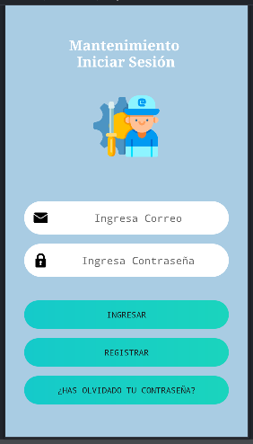

Se ingraesa con un *Usuario y Contraseña*, con la posibilidad de restaurar el acceso en caso de olvidarse la contraseña de acceso.

### Panel Principal:

    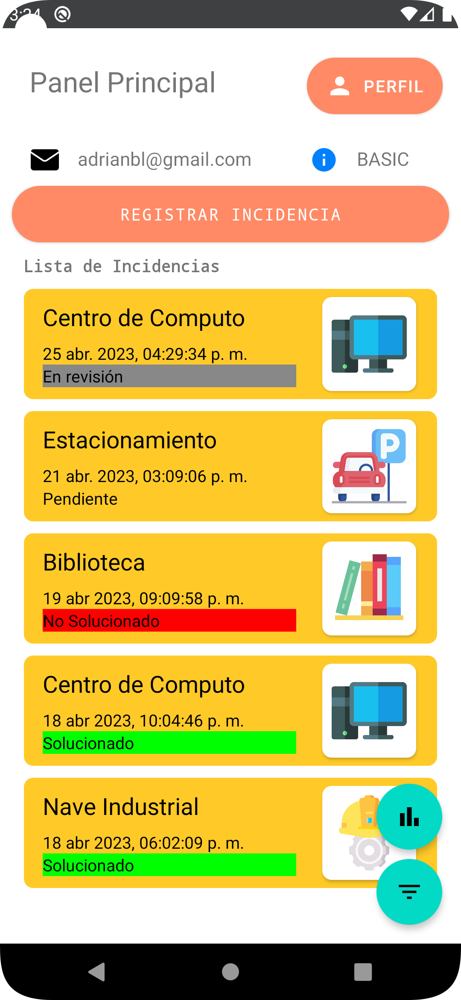

Se observa la interfaz principal donde se observa el despliegue de incidencias y el estado de estas.

Las incidencias presentes pueden variar dependiendo el usuario y es necesario completar el perfil del usuario para poder tener acceso y vista de las incidencias asi como para poder registrarlas y atendenderlas.
Se muestra la vista principal sin incidencias:

    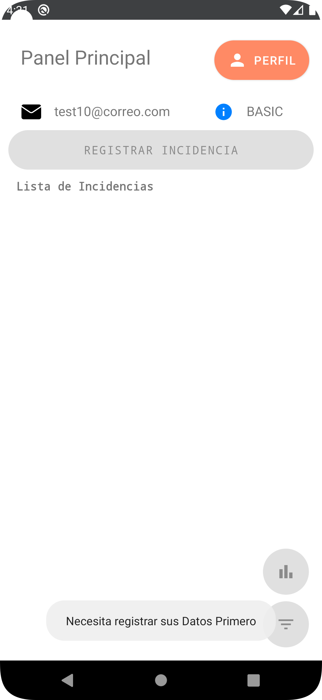

### Sin conexión

En caso de no contar con conexión a internet o esta verse interrumpida se despliega la siguiente vista:

    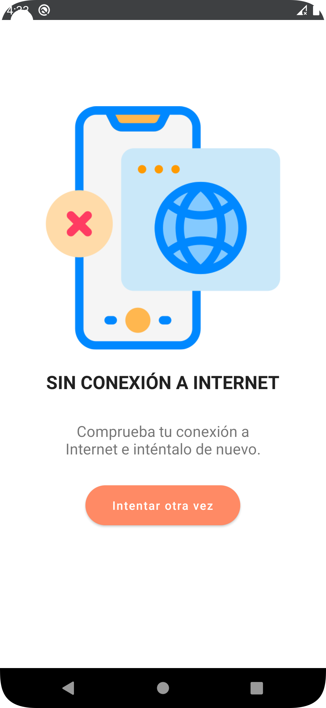

### Perfil de Usuario

En la vista de perfil de usuario es necesario completar el perfil para desbloquear las funciones disponibles.

Los roles son asigandos por el Administrador.

    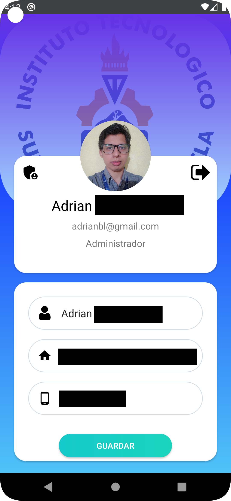

### Perfil de Administrador

El administrador tiene el privilegio se asignar los roles a los demas usuarios registrados en la Aplicación.

    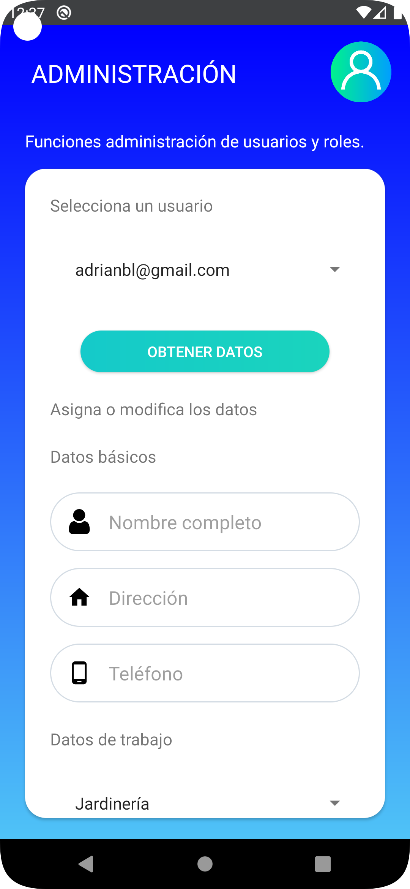

Consulta de Usuarios Registrados:

El administrador de igual forma puede consultar los datos de los usuarios y modificarlos.

    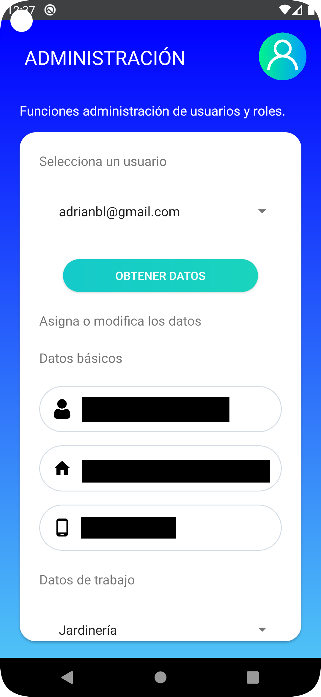

### Uso del TimePickerFragment

Entre los parémetros de los usuarios está el horario laboral de estos y para ello se hace uso del Fragment de TimePicker para asigar los horarios.

    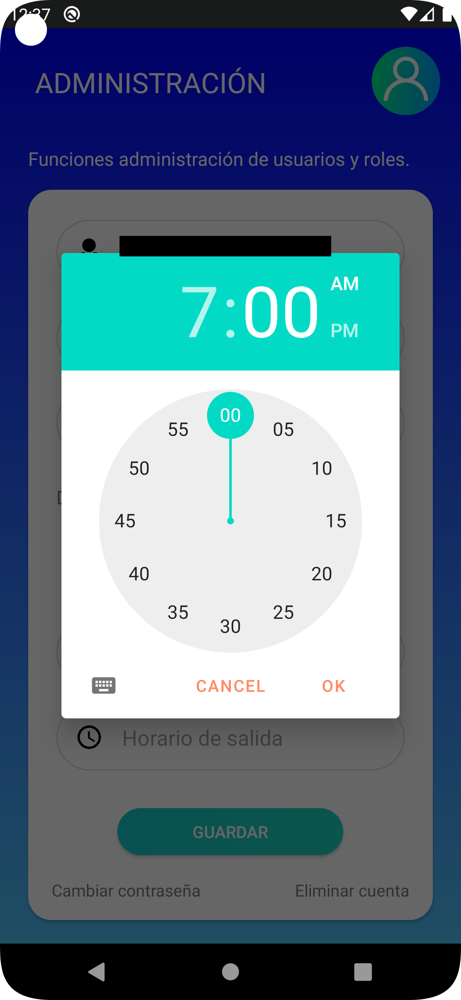

### Realizar el reporte de una Incidencia

Se muestra la interfaz para realizar las incidencias.

Se solicitan datos como el área quien le corresponde atender el incidente, el área donde se suscita, descripción del incidente y una foto (opcional) de evidencia.

    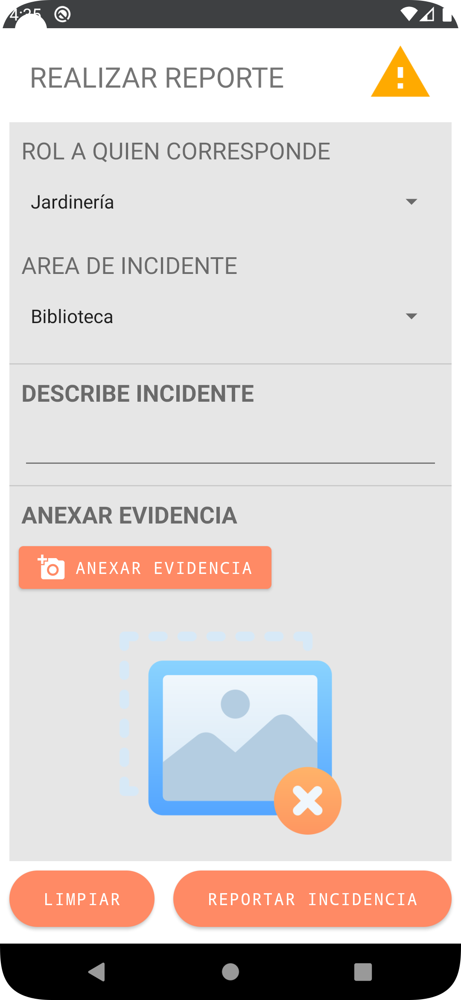

Datos llenos para realizar un reporte:

    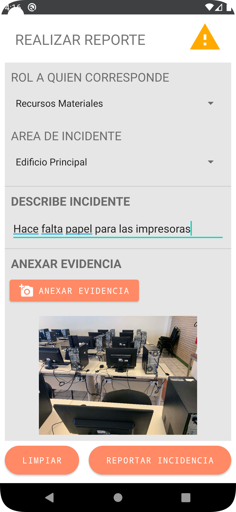

Confirmación:

    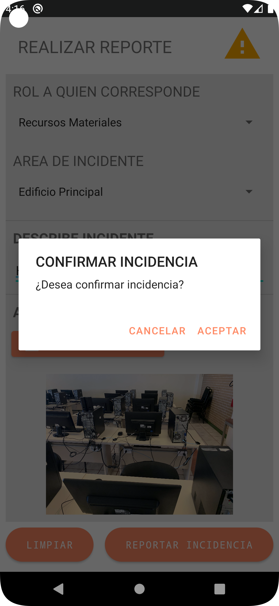

Detalles de la Incidencia enviada:

    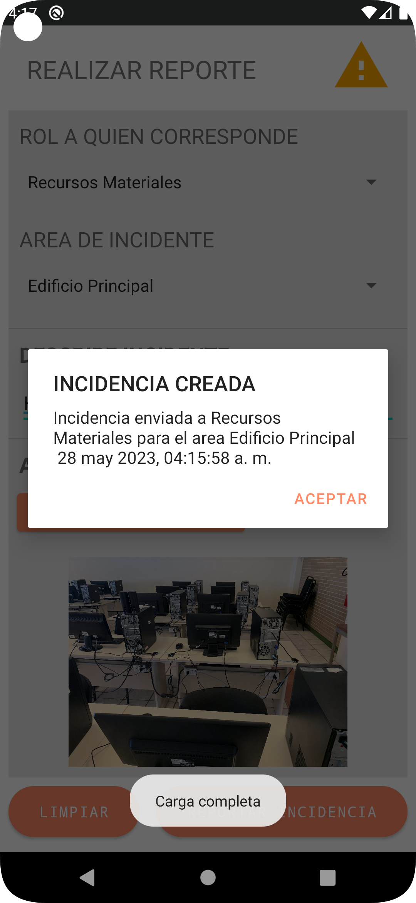

### Registrar estado de una Incidencia:

Para el registro del estado se solicitan datos como el estado que entre las opciones está (Solucionado, pendiente, en revisión y no solucionado), una descripción de lo que se hizo para atender el incidente y una foto del incidente (opcional) para anexar.

Registro del estado de la Incidencia:

    

Esta operación se realiza despues de haber atendido el incidente.

Confirmación del estado de la Incidencia:

    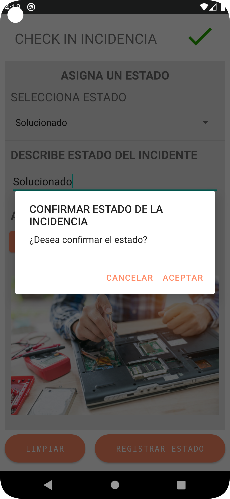

Detalles del estado de la Incidencia enviada:

    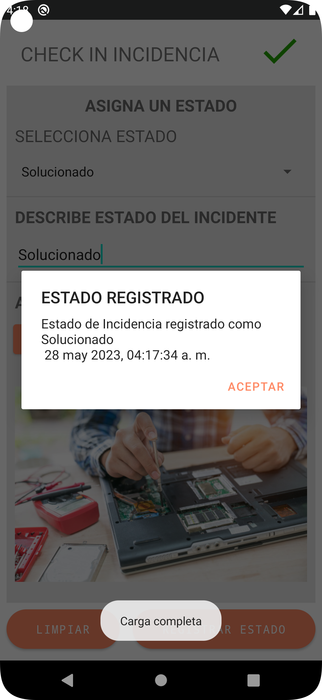

### Incidencia atendida:

Vista de la Incidencia atendida:

    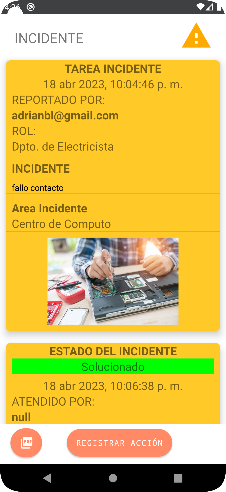

Datos del Usuario que registró la Incidencia:

    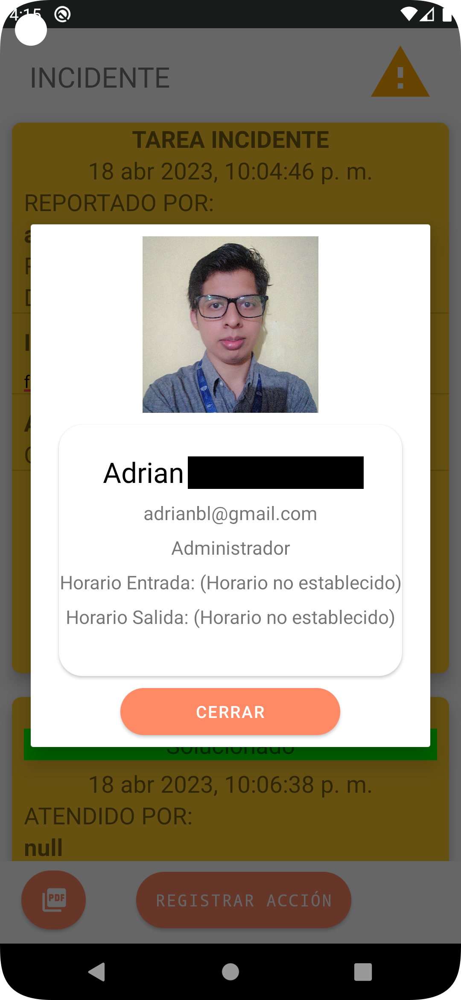

### Generar Reportes:

Vista para la Exportación de Incidencias completadas:

    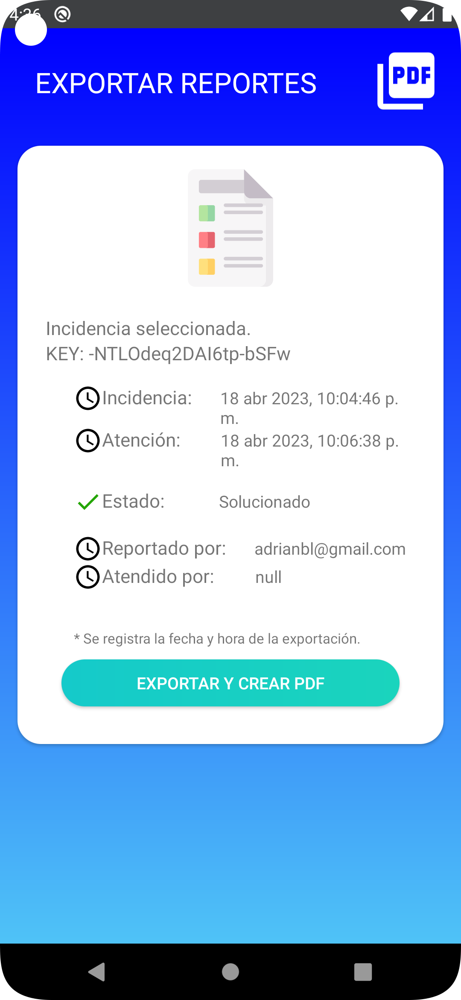

Formato del PDF generado de una Incidencia completada:

El documento exportado se alamacena en el dispositivo movil y contiene todos los datos de la incidencia desde que se reporta hasta que se atiende y los datos correspondientes. Para este caso algunos datos son omitidos.

    

### Estadisticas (Desarrollo trunco):

El objetivo de las estadisticas es la de mostrar la cantidad de incidencias y un registro de los tipos de incidencias desplegados y de las incidencias atenidas representado con gráficos.

*Esta una función que no se terminó de implementar* :(

Vista de las Estadísticas #1:

    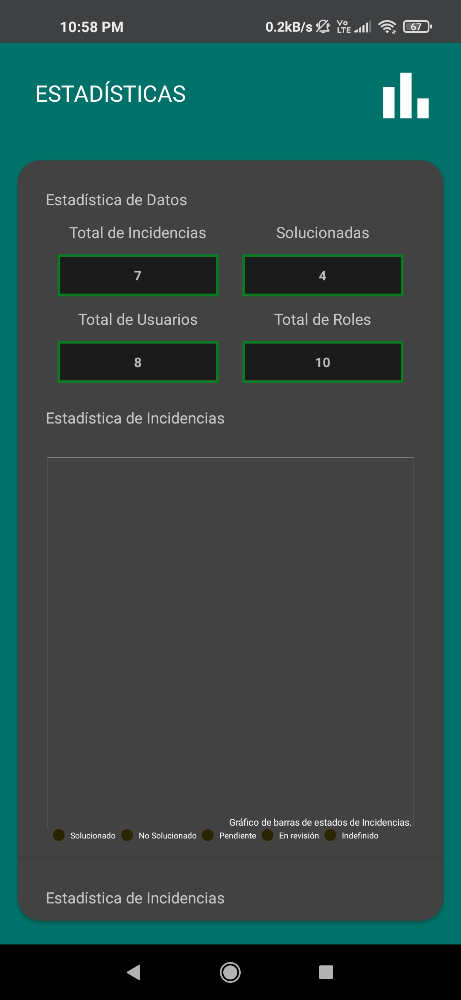

Vista de las Estadísticas #2:

    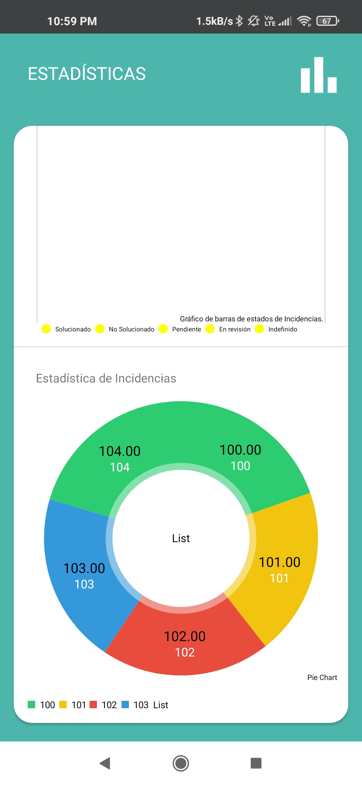

---

La aplicación se desarrolló con el objetivo de brindar una herramienta para la gestión de incidencias para el área de Mantenimiento en una dependencia.

ℹ️ Este proyecto se realizó con fines académicos.

